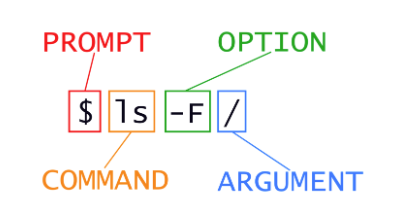

**1. Introducing the Shell**
This page contain a short and adapted version of the Software Carpentry lesson [The shell](https://swcarpentry.github.io/shell-novice/). We will use it as notes to key concepts we will discuss during our lesson. 


**Shell and prompt ($)**

- Graphical user interface (GUI) versus command line interface (CLI)
- The most popular Unix shell is Bash (the Bourne Again SHell — so-called because it’s derived from a shell written by [Stephen Bourne](https://en.wikipedia.org/wiki/Stephen_R._Bourne))
- Instructions to computer through shell are given as text in commands (followed by `Enter`) or sequences of commands (scripts) 
- The command line is necessary to interact with remote machines and supercomputers
- Raw sequence data can only be analyzed on super computers

```diff
+ the prompt symbol $. Prompt might look different  than $. 
user1@vm-corso-colonna:\~$
```

Type a command at the prompt (do not type the prompt) and send the command with `Enter`

```diff
user1@vm-corso-colonna:~$ echo focaccia al pomodoro 
focaccia al pomodoro

user1@vm-corso-colonna:~$ ls  
Shell-lesson-data

user1@vm-corso-colonna:~$ ks   
ks: command not found
```

**2. Navigating Files and Directories**

- File system: the part of the operating system responsible for managing files and directories.
		 It organizes our data into files, which hold information, and directories (also called ‘folders’), which hold files or other directories.

``` diff 
+ COMMAND  pwd stands for print working directory
 ```

user1@vm-corso-colonna:~$ pwd   
/home/user1

**root (/)**

```diff
+ Root (/) is the top-level directory in a Unix/Linux filesystem hierarchy:
+ ~ means home, your space in the filesystem 
+ ~$ means you are at the prompt in your home directory 

user1@vm-corso-colonna:~$ cd /  
user1@vm-corso-colonna:/$ pwd  
user1@vm-corso-colonna:/
│
├── bin/
├── boot/
├── data/
├── dev/
├── etc/
├── home/
+│   └── user1/      # Your home directory (~)
├── lib/
├── lib32/
├── lib64/
├── libx32/
├── lost+found/
├── media/
├── mnt/
├── opt/
├── proc/
├── root/
├── run/
├── sbin/
├── snap/
├── srv/
├── sys/
├── tmp/
├── usr/
└── var/

```

```
user1@vm-corso-colonna:~
│
└─── shell-lesson-data/
     │
     └─── exercise-data/
          ├─── alkanes/         [DIR]
          ├─── animal-counts/   [DIR]
          ├─── creatures/       [DIR]
          ├─── numbers.txt      [FILE]
          ├─── project/         [DIR]
          └─── writing/         [DIR]
```


``` diff 
+ COMMAND ls stands for list directory contents

user1@vm-corso-colonna:~$ ls  
Shell-lesson-data
```


``` diff 
+ COMMAND use --help and man  learning about command options 

user1@vm-corso-colonna:~$  ls --help

user1@vm-corso-colonna:~$  man ls
```

Exploring Other Directories
```
user1@vm-corso-colonna:~$ ls  /home   

/home/
├── ubuntu/        # System user
└── user1-35/      # Course participants
    ├── user1/     # ← You are here
    ├── user2/
    ├── user3/
    ├── ...
    └── user35/
```


``` diff 
+ COMMAND  cd stands for change the shell working directory 

user1@vm-corso-colonna:~$ ls 
shell-lesson-data

user1@vm-corso-colonna:~$ cd shell-lesson-data/

user1@vm-corso-colonna:~/shell-lesson-data$ pwd 
/home/user1/shell-lesson-data
```


**.hidden files** 

>> Go to the [CHALLENGES](https://swcarpentry.github.io/shell-novice/02-filedir.html) of the SC lesson __ls Reading Comprehension__


**2a. General Syntax of a Shell Command**




+ Options (also referred as switches or flags)** change the behavior of a command  
		single dash (-) short options  
		two dashes (--) long options

**Arguments** tell the command what to operate on (e.g. files and directories). 

**Parameters:**  options and arguments .

**Space** Each part is separated by spaces. If you omit the space between ls and \-F the shell will look for a command called ls-F, which doesn’t exist  
**Capitalization**    
ls \-s will display the size of files and directories alongside the names   
ls \-S will sort the files and directories by size

user1@vm-corso-colonna:\~/shell-lesson-data/exercise-data$ ls \-S   
alkanes  animal-counts  creatures  writing  numbers.txt  
user1@vm-corso-colonna:\~/shell-lesson-data/exercise-data$ ls \-s  
total 20  
4 alkanes  4 animal-counts  4 creatures  4 numbers.txt  4 writing

Nelle’s   
user1@vm-corso-colonna:\~/shell-lesson-data$ ls north-pacific-gyre/  
NENE01729A.txt  NENE01736A.txt  NENE01751B.txt  NENE01843A.txt  NENE01971Z.txt  NENE01978B.txt  NENE02040A.txt  NENE02040Z.txt  NENE02043B.txt  goostats.sh  
NENE01729B.txt  NENE01751A.txt  NENE01812A.txt  NENE01843B.txt  NENE01978A.txt  NENE02018B.txt  NENE02040B.txt  NENE02043A.txt  goodiff.sh

**3\. Working With Files and Directories**

EXERCISE: See where we are with $pwd  and move to  exercise-data/writing, see what it contains 

### **3a. Create a directory** 

COMMAND: mkdir make directories

user1@vm-corso-colonna:\~/shell-lesson-data/exercise-data/writing$  mkdir thesis

user1@vm-corso-colonna:\~/shell-lesson-data/exercise-data/writing$ ls   
LittleWomen.txt  haiku.txt  thesis

user1@vm-corso-colonna:\~/shell-lesson-data/exercise-data/writing$ ls \-F thesis/  
user1@vm-corso-colonna:\~/shell-lesson-data/exercise-data/writing$\`

\-p option allows mkdir to create a directory with nested subdirectories in a single operation

user1@vm-corso-colonna:\~/shell-lesson-data/exercise-data/writing$ mkdir \-p ../project/data ../project/results  
user1@vm-corso-colonna:\~/shell-lesson-data/exercise-data/writing$ ll

The \-R option to the ls command will list all nested subdirectories within a directory

user1@vm-corso-colonna:\~/shell-lesson-data/exercise-data/writing$ ls \-FR ../project/  
../project/:

data/  results/  
../project/data:

../project/results:

**Good names for files and directories**

1. Don’t use spaces.  
2. Don’t begin the name with \- (dash)  
3. Stick with lowercase letters, numbers, . (period or ‘full stop’), \- (dash) and \_ (underscore)

### **3b. Create a text file**

EXERCISE: See where we are with $pwd  and move to  `thesis` see what it contains 

user1@vm-corso-colonna:\~/shell-lesson-data/exercise-data/writing/thesis$ ls  
user1@vm-corso-colonna:\~/shell-lesson-data/exercise-data/writing/thesis$ nano draft.txt

* **Control, Ctrl, or ^ Key**  
* **File names and extensions** 


  
**3c. Moving files and directories**

EXERCISE: See where we are with $pwv and return to the shell-lesson-data/exercise-data/writing directory  
user1@vm-corso-colonna:\~/shell-lesson-data/exercise-data/writing$ pwd   
/home/user1/shell-lesson-data/exercise-data/writing

COMMAND: mv \- move (rename) files

user1@vm-corso-colonna:\~/shell-lesson-data/exercise-data/writing$ ls thesis/  
draft.txt  
user1@vm-corso-colonna:\~/shell-lesson-data/exercise-data/writing$ mv thesis/draft.txt  thesis/quotes.txt  
user1@vm-corso-colonna:\~/shell-lesson-data/exercise-data/writing$ ls thesis/  
quotes.txt

move quotes.txt into the current working directory “.”

user1@vm-corso-colonna:\~/shell-lesson-data/exercise-data/writing$  mv thesis/quotes.txt .  
user1@vm-corso-colonna:\~/shell-lesson-data/exercise-data/writing$ ls   
LittleWomen.txt  haiku.txt  quotes.txt  thesis

user1@vm-corso-colonna:\~/shell-lesson-data/exercise-data/writing$ ls thesis/  
user1@vm-corso-colonna:\~/shell-lesson-data/exercise-data/writing$ 

**3d. Copying files and directories** 

COMMAND:   cp \- copy files and directories

user1@vm-corso-colonna:\~/shell-lesson-data/exercise-data/writing$  cp quotes.txt thesis/quotations.txt  
user1@vm-corso-colonna:\~/shell-lesson-data/exercise-data/writing$ ls   
LittleWomen.txt  haiku.txt  quotes.txt  thesis  
user1@vm-corso-colonna:\~/shell-lesson-data/exercise-data/writing$ ls thesis/  
quotations.txt  
user1@vm-corso-colonna:\~/shell-lesson-data/exercise-data/writing$ 

**3e. Removing files and directories**

COMMAND: rm \- remove files or directories

user1@vm-corso-colonna:\~/shell-lesson-data/exercise-data/writing$ rm quotes.txt   
user1@vm-corso-colonna:\~/shell-lesson-data/exercise-data/writing$ ls  
LittleWomen.txt  haiku.txt  thesis

* **Deleting Is Forever**

