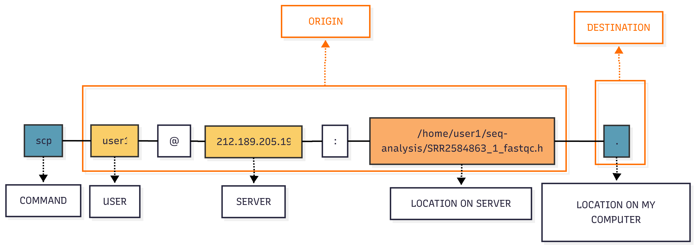

[back to course home page ](../README.md)

## Short read data analysis workflow
This workflow shows how raw DNA sequencing data is processed from initial reads to final variant calls. Each colored box represents a file format, while arrows indicate the bioinformatics tools used for transformation. The pipeline begins with FASTQ files containing raw sequencing reads and ends with VCF files containing identified genetic variants.

````mermaid
graph LR
    A[FASTQ] -->|FastQC/Trimmomatic| B[FASTQ]
    B -->|BWA/Bowtie2| C[SAM/BAM]
    C -->|Clean/Sort| D[BAM]
    D -->|GATK/bcftools| E[VCF]
    
    style A fill:#FA6868,stroke:#1B3C53,stroke-width:2px,color:#1B3C53
    style B fill:#5A9CB5,stroke:#333,stroke-width:2px,color:#1B3C53
    style C fill:#FACE68,stroke:#333,stroke-width:2px,color:#1B3C53
    style D fill:#FAAC68,stroke:#333,stroke-width:2px,color:#1B3C53
    style E fill:#FA6868,stroke:#333,stroke-width:2px,color:#1B3C53

````

```diff
+ We will go to the wrokflow while learning more bash commands: zcat,  

```
### **1. Understanding FASTQ Format**

[FASTQ](https://en.wikipedia.org/wiki/FASTQ_format) files contain raw sequencing reads with four lines per sequence:

```
@SRR2584863.1 HWI-ST957:244:H73TDADXX:1:1101:4712:2181/1
TTCACATCCTGACCATTCAGTTGAGCAAAATAGTTCTTCAGTGCCTGTTTAACCGAGTCACGCAGGGGTTTTTGGGTTACCTGATCCTGAGAGTTAACGGTAGAAACGGTCAGTACGTCAGAATTTACGCGTTGTTCGAACATAGTTCTG
+
CCCFFFFFGHHHHJIJJJJIJJJIIJJJJIIIJJGFIIIJEDDFEGGJIFHHJIJJDECCGGEGIIJFHFFFACD:BBBDDACCCCAA@@CA@C>C3>@5(8&>C:9?8+89<4(:83825C(:A#########################
```
```diff
+ Line 1: Header with @ followed by sequence ID
+ Line 2: Raw sequence (DNA bases)
+ Line 3: Separator (+)
+ Line 4: Quality scores (ASCII encoded)

+ Quality encoding: !"#$%&'()*+,-./0123456789:;<=>?@ABCDEFGHIJ
+                   |         |         |         |         |
+ Quality score:    01........11........21........31........41
```


```diff
! EXERCISE: See where we are with $pwd  and move to  /home/user1/genomic-lesson-data/ #pay attention to user number!! 
! Check the content of untrimmed_fastq/ see what it contains, note the gz extension of the files  

+ COMMAND: gzip, gunzip, zcat - compress or expand files
+ COMMAND: head - output the first part of files
```

Use `zcat` combined with `head` to inspect the content of the `SRR2584863_1.fastq.gz`  file: 
```
user1@vm-corso-colonna:~/genomic-lesson-data/untrimmed_fastq$ zcat SRR2584863_1.fastq.gz  | head -n 4
@SRR2584863.1 HWI-ST957:244:H73TDADXX:1:1101:4712:2181/1
TTCACATCCTGACCATTCAGTTGAGCAAAATAGTTCTTCAGTGCCTGTTTAACCGAGTCACGCAGGGGTTTTTGGGTTACCTGATCCTGAGAGTTAACGGTAGAAACGGTCAGTACGTCAGAATTTACGCGTTGTTCGAACATAGTTCTG
+
CCCFFFFFGHHHHJIJJJJIJJJIIJJJJIIIJJGFIIIJEDDFEGGJIFHHJIJJDECCGGEGIIJFHFFFACD:BBBDDACCCCAA@@CA@C>C3>@5(8&>C:9?8+89<4(:83825C(:A#########################

! How is the quality at the end of the read? 
```

### **Quality Control of Genomics Data**
The following contains a short and adapted version of the Data Carpentry lesson [Assessing Read Quality](https://datacarpentry.github.io/wrangling-genomics/02-quality-control.html). We will use it as notes to key concepts we will discuss during our lesson.

##### **Why Quality Control in Genomics?**
Quality control helps us identify and remove problematic data before analysis. Poor quality data can lead to incorrect biological conclusions

- **Sequencing errors** - Base calling mistakes increase towards the end of reads
- **Adapter contamination** - Sequencing adapters can appear in your reads
- **Low quality bases** - Can lead to false variant calls and misassemblies
- **Contamination** - From other organisms or samples


##### **Quality Score Encoding**

- Phred quality scores: Q = -10 × log10(P), where P is error probability
- Q30 = 99.9% accuracy (1 error in 1000 bases)
- Q20 = 99% accuracy (1 error in 100 bases)

### **Running FastQC**

[`FastQC`](https://www.bioinformatics.babraham.ac.uk/projects/fastqc/) is a software that performs quality control checks on raw sequence data

```diff
!EXERCISE try to learn about fastqc using man 

enza@iusato:~/iusatoProtocol/LongReadSeqDataAnalysis$ man fastcq 
No manual entry for fastcq

! why it does not work? 
! try instead user1@vm-corso-colonna:~/genomic-lesson-data$ fastqc -h | less 

```

Before starting it is good practice to create a dedicated folder where all the ananlyses will be performed and never work in the folder where the data is. We will make a folder named seq-analysis  in our home and work from there 

```
user1@vm-corso-colonna:~$ cd  # make sure to eb in your home dir 
user1@vm-corso-colonna:~$ mkdir seq-analysis
user1@vm-corso-colonna:~$ ls 
genomic-lesson-data  seq-analysis  shell-lesson-data
user1@vm-corso-colonna:~$ cd seq-analysis/
user1@vm-corso-colonna:~/seq-analysis$ 

```

We will check the quality of our sequence reads using `fastqc` 

```diff
user1@vm-corso-colonna:~$ ls 
datadata  genomic-lesson-data  resres  seq-analysis  shell-lesson-data
user1@vm-corso-colonna:~$ cd seq-analysis/
+ user1@vm-corso-colonna:~/seq-analysis$ fastqc ../genomic-lesson-data/untrimmed_fastq/SRR2584863_1.fastq.gz -o . 
application/gzip
Started analysis of SRR2584863_1.fastq.gz
Approx 5% complete for SRR2584863_1.fastq.gz
Approx 10% complete for SRR2584863_1.fastq.gz
...
Approx 95% complete for SRR2584863_1.fastq.gz
Analysis complete for SRR2584863_1.fastq.g
```

### **Interpreting FastQC Results**
`FastQC` generates two output files: an HTML report and a ZIP archive. HTML files are web-based documents that require a browser to view properly - they can not be opened directly on command-line servers. To view the HTML report, we need to **transfer it from the remote server to our local computer** where we can open it in a web browser. This file transfer process is an essential skill for working with bioinformatics pipelines on computing clusters.



We will transfer the results of `FastQC`  from the server to your laptop: 

```diff 
+ COMMAND scp copies files between hosts on a network
! 1. open a new terminal in your laptop and use pwd to understand where you are 
! 2. navigate to the Desktop and make a folder named fastqc-res
! 3. cd to fastqc-res and execute: 
 scp  user1@212.189.205.193:/home/user1/seq-analysis/SRR2584863_1_fastqc.html . 
```


##### **Understanding FastQC Quality Plots**

```diff
! EXERCISE: On your laptop open the FastQC HTML report using the graphic interface (i.e. double click on it), and identify which metrics pass/warn/fail

keep in mind: 
+ **Green** = Good quality
! **Orange** = Warning (acceptable)
- **Red** = Poor quality (needs attention)

+ Per base sequence quality - Shows quality scores across all bases
+ Per sequence quality scores - Distribution of mean quality per read  
+ Per base sequence content - Nucleotide proportions at each position
+ Sequence length distribution - Read length consistency
+ Adapter content - Presence of sequencing adapters
```

### **Running FastQC on Multiple Files**

```diff
+ Use wildcards to process multiple files at once
```
